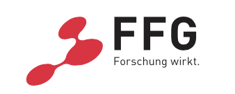

# FAIRmedia Research Project

An innovative project for the fair and trustworthy use of artificial intelligence in the media.

More info on the [project website](https://www.joanneum.at/digital/en/projects/fairmedia/).

## Acknowledgement

FAIRmedia receives funding from the Austrian Federal Ministry for Climate Action, Environment, Energy, Mobility, Innovation and Technology.

